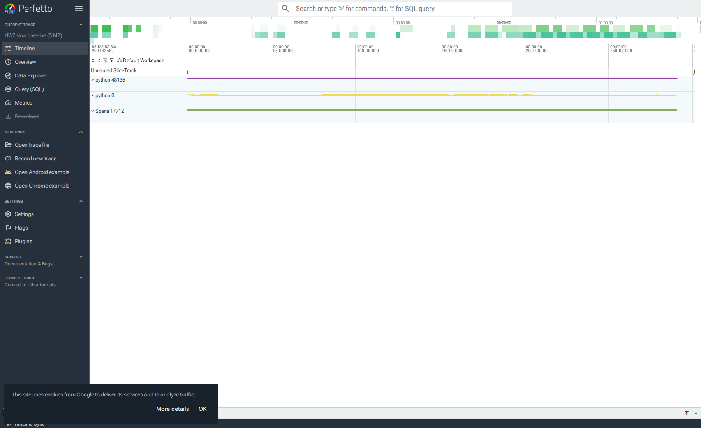
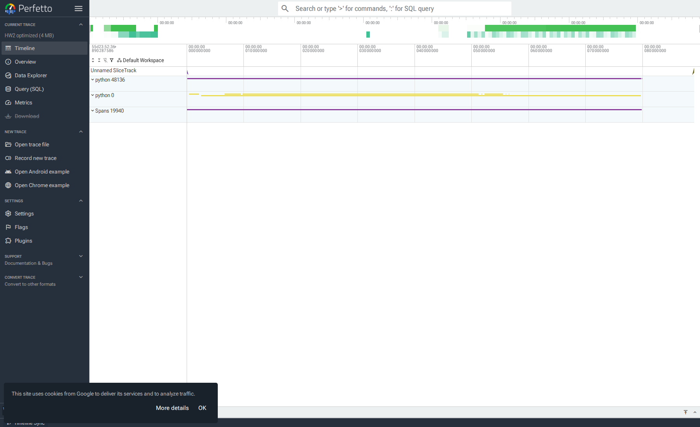
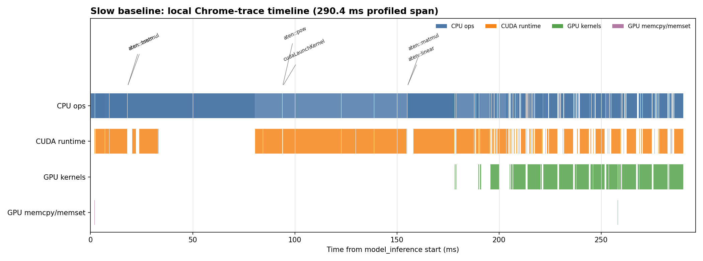
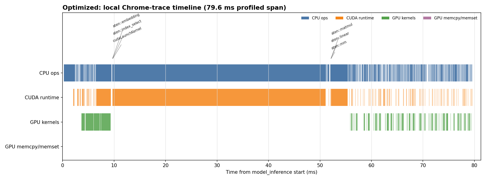
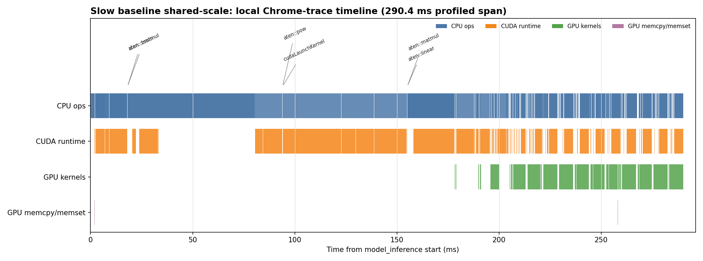
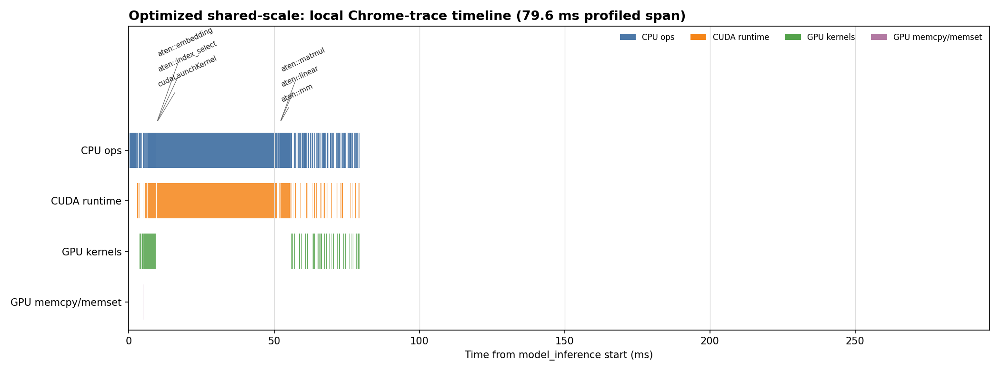

# HW2 Inference Optimization Insights

## Final result

Command used: `../.venv/bin/python hw2_task.py`

Environment: NVIDIA H100 80GB HBM3, PyTorch 2.9.1+cu128, Transformers 4.57.6.

Final measured output:

| Version | Time for 128 tokens | Throughput | Speedup |
| --- | ---: | ---: | ---: |
| Slow baseline | 0.95 s | 134.6 tok/s | 1.00x |
| Optimized | 0.17 s | 738.2 tok/s | 5.49x |

The final `optimized_loop()` uses `torch.inference_mode()`, keeps token IDs on GPU until the end, uses `past_key_values` for KV cache decoding, passes only the latest token after prefill, asks Transformers for only the last logit with `logits_to_keep=1`, and keeps fp32 weights because fp32 measured fastest on this H100 for this tiny model.

## Optimization ladder

These timings were measured one fix at a time with a short warmup before each timed run.

| Step | Change | Time | Speedup vs baseline | Insight |
| --- | --- | ---: | ---: | --- |
| v0 | Naive slow loop: full sequence each step, `.item()`, `torch.cat`, fp32 | 0.9427 s | 1.00x | Most time is repeated full-context work. |
| v1 | Add `torch.inference_mode()` | 0.9290 s | 1.01x | Autograd bookkeeping is not the main bottleneck here. |
| v2 | Remove per-token `.item()` sync | 0.8843 s | 1.07x | Helps, but repeated model work still dominates. |
| v3 | Preallocate generated IDs instead of growing with `torch.cat` | 0.8830 s | 1.07x | Avoiding token-buffer reallocations barely matters while every step still recomputes the prompt. |
| v4 | Use KV cache, one-token decode, `logits_to_keep=1`, fp32 | 0.1410 s | 6.69x | Biggest win: prefill once, then decode one token at a time. |
| v5 | Same KV-cache loop with bf16 | 0.1666 s | 5.66x | bf16 was slower than fp32 for this tiny/H100 setup, so the final code uses fp32. |

I also tried fp16 and a `StaticCache` variant. fp16 produced different token previews and was not faster in the profiled path; `StaticCache` was slower in the quick benchmark, so neither is used in the final answer.

## Trace screenshots

I loaded the profiler Chrome trace JSON files in the real Perfetto UI (`https://ui.perfetto.dev`) using Perfetto's documented `postMessage` trace-loading path, then captured the UI with headless Chromium.

Slow baseline in Perfetto UI:

Optimized in Perfetto UI:

I also kept the earlier local timeline renderings as secondary comparison images:

## What the trace images show

The slow baseline image stretches across about 290 ms for only 12 profiled decode steps. The CPU, CUDA runtime, and GPU lanes are busy for a long span because each step sends the entire growing sequence back through the model. The trace counters confirm the visible waste: `aten::item` appears 12 times and costs about 45 ms in the profiled run, `aten::cat` appears 120 times, and GPU kernels total about 80 ms.

The optimized image compresses the same 12-step profile to about 80 ms. The per-token CPU sync is gone (`aten::item` count is 0), the GPU kernel total drops to about 12.8 ms, and CUDA runtime events drop from 1565 to 1158. The remaining `aten::cat` bars are mostly from dynamic KV-cache maintenance, not from rebuilding the generated token sequence every loop iteration.

The shared-scale screenshots make the speedup visually obvious: the optimized trace occupies only the early part of the baseline time window. That matches the unprofiled timing result, where the final loop improves from 0.95 s to 0.17 s for 128 generated tokens.

## Biggest win

KV cache is the decisive optimization. The naive loop repeats attention and MLP work over a 1024-token prompt plus all generated tokens every step. With `past_key_values`, the model pays the full prompt cost once, then each subsequent step processes only the new token while attending to cached keys and values. Removing `.item()` and avoiding token-buffer `cat` are worthwhile cleanup, but they are small compared with eliminating repeated full-sequence forwards.
